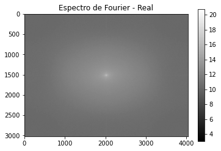
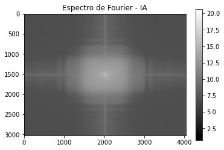

# Fourier AI Image Analysis

Small project I worked on during the summer to explore differences between real and AI-generated images using the Fourier transform.

## Idea

The idea was to look at images in the frequency domain instead of comparing them directly at pixel level.

The process is simple:

1. Convert the image to grayscale.
2. Store it as a NumPy matrix.
3. Compute the 2D Fourier transform.
4. Center the frequencies and visualize the magnitude spectrum using a logarithmic scale.

## Results

In the images I tested, I found a clear visual difference between the Fourier spectra.

The real image produces a relatively homogeneous spectrum, while the AI-generated image shows more visible horizontal and vertical structures.

### Real image



### AI-generated image



These patterns could be related to artifacts introduced during the image generation process. More images would need to be tested before drawing any general conclusions.

## Technologies

- Python
- NumPy
- Pillow
- Matplotlib

## Project structure

```text
src/
    image_to_matrix.py
    fourier_analysis.py
    rotate_image.py

results/
    fourier_real_01.png
    fourier_ai_01.png
